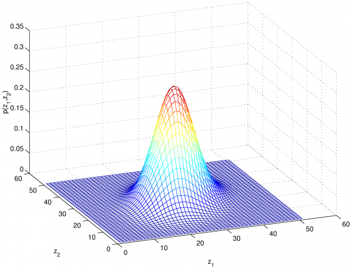

# Awesome Statistics & Machine Learning

- Materials about mathematical statistics, statistical computing, Bayesian statistics, multivariate statistics, and many other sub-fields of this beautiful discipline along with materials about machine learning, mathematics, & data science.
- Each folder containts code I have written. This can range from simulations, implemenations of algorithms, and some data science examples.
- In addition, there is a file titled `references.md` that contains free references for statistics,mathematics, and machine learning that I personally find useful.
- I take pull requests for anything in this repo as I see fit.

## Structure of Repo

- Bayesian Statistics
- Machine Learning
- Mathematical Statistics/Probability
- Multivariate Statistics
- Statistical Computing
- Time Series

## Software
- Currently, all implementations and scripts are in R & Matlab
